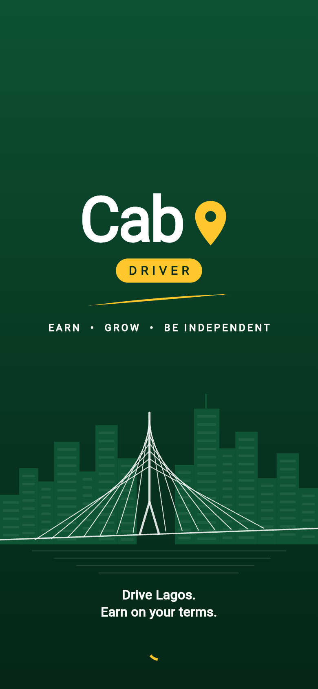
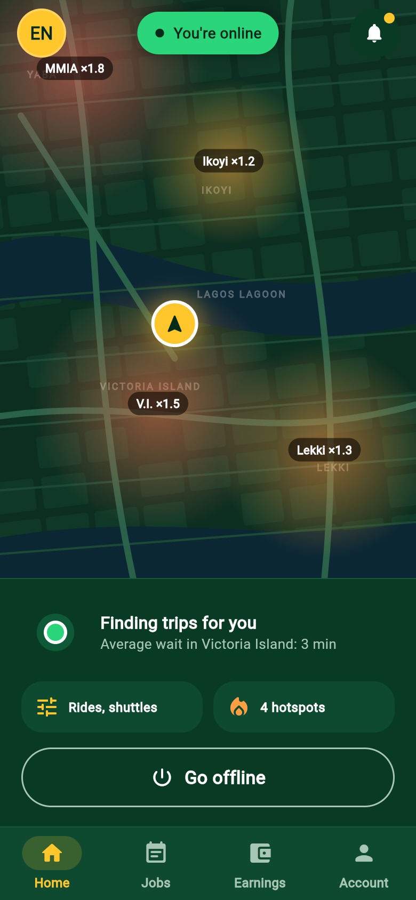
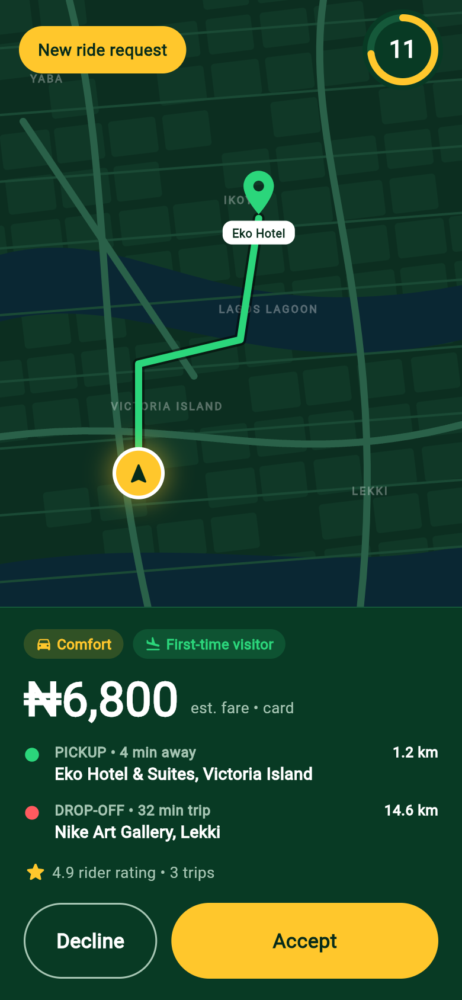
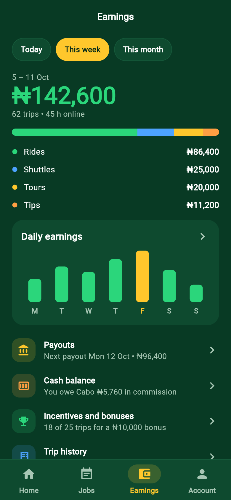

# Cabo Driver App

Mobile app (Android first, then iOS) for drivers and driver-guides to receive and complete rides, shuttles and tour jobs, and track earnings.

This is a clickable prototype of every screen in the *Cabo Driver App: Description and Screens* spec. It uses sample data and has no backend yet. Buttons move through the real flows: onboarding, going online, the full ride from request to rating, airport and tour jobs, and so on. **Account → All screens** lists every screen so you can jump straight to one.

<p>
  
  
  
  
</p>

Screenshots of all screens are in [`screenshots/driver/`](../screenshots/driver). File names follow the spec numbering, so `03-06-trip-in-progress.png` is screen 3.6.

## Run it

```sh
cd driver-app
flutter pub get
flutter run            # on a connected Android device or emulator
flutter test           # every screen renders at phone size without layout overflow
```

GitHub Actions runs the tests and builds a release APK on every push that changes this folder (see the root README).

## Layout

| Path | What's there |
| --- | --- |
| `lib/routes.dart` | Every screen with its spec number and route |
| `lib/screens/` | One file per spec section: onboarding, home, trips, jobs, earnings, performance, safety, account, system |
| `lib/widgets/` | Shared pieces: buttons, cards, the logo, the painted map, charts, bottom navigation |
| `lib/theme.dart` | Brand colours and text styles |
| `assets/fonts/` | Poppins, plus a small Noto Sans subset for the naira sign (₦) |
| `tool/screenshots.js` | Regenerates `screenshots/driver/` |

## Regenerating screenshots

The screenshots come from a web build of the same code, with timers and looping animations turned off so they look the same every run:

```sh
flutter build web --release --no-web-resources-cdn --dart-define=SCREENSHOT_MODE=true
npm install --no-save playwright && npx playwright install chromium
node tool/screenshots.js build/web ../screenshots/driver
```

## Not done yet

- **Maps** are drawn by the app (`lib/widgets/map.dart`) as a stand-in. Swap in Google Maps or Mapbox when there is an API key.
- **Data** is hard-coded sample data until the backend exists.
- **Launcher icon** is still the Flutter default.
- **Release signing**: CI builds are signed with the debug key, which is fine for test phones but not for the Play Store.
